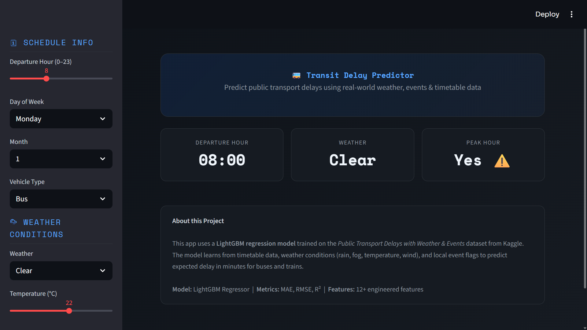

# 🚌 Transit Delay Prediction

[](https://python.org)
[](https://lightgbm.readthedocs.io)
[](https://streamlit.io)
[](LICENSE)

> 🚍 A machine learning web app that predicts public transport delays using weather, time, and event data.

---

## 🎯 Live Demo

🔗 *Add your Streamlit link here after deployment*



---

## 📌 Overview

Public transport delays are influenced by multiple real-world factors such as weather, peak hours, and events.  
This project builds an end-to-end ML system to **predict delay in minutes**, helping improve travel planning.

---

## 📁 Project Structure
transport-delay-predictor/
│
├── app.py                  # Streamlit app
├── requirements.txt        # Dependencies
├── README.md
│
├── model/                  # Trained artifacts
│   ├── lgbm_model.pkl
│   ├── label_encoders.pkl
│   └── feature_columns.pkl
│
├── data/                   # Dataset
│   └── dataset.csv
│
├── notebook/               # Jupyter notebooks
│   └── *.ipynb
│
├── assets/                 # Images for README
│   └── screenshot.png
---

## 📊 DatasetSynthetic dataset inspired by real-world transport systems.**Includes:**- 🕐 Time (hour, weekday, month, peak hours)- 🌦 Weather (temperature, wind, visibility)- 📍 Context (events, route type, vehicle type)**Target:**- `delay_minutes` → delay in minutes---## ⚙️ Feature Engineering- Time-based features (hour, weekday, month)- Peak hour & weekend indicators- Label encoding for categorical features- Feature alignment for model consistency---## 🧠 Model- **Algorithm:** LightGBM Regressor  - **Objective:** Predict delay in minutes  - **Split:** 80/20  - **Early Stopping:** 50 rounds  **Metrics:**- MAE  - RMSE  - R²  ---## 🚀 Run Locally```bashgit clone https://github.com/RahulSingh-DS/transit-delay-predictor.gitcd transit-delay-predictorpip install -r requirements.txtstreamlit run app.py

🌐 Deployment
Deploy using Streamlit Cloud:


Push repo to GitHub

Connect repo on Streamlit Cloud

Select app.py

Deploy


🛠 Tech Stack

Python, Pandas, NumPy

LightGBM, Scikit-learn

Streamlit


👤 Author
Rahul Singh
🔗 https://github.com/RahulSingh-DS

📄 License
MIT License
---# 🔥 What Changed (Important)- Fixed folder structure ✅  - Removed wrong `dataset.csv` placement ❌  - Cleaned explanation (no unnecessary text)  - Made it **skimmable (recruiter-friendly)**  - Aligned with your actual project  ---# 🚀 Optional Upgrade (HIGH IMPACT)Add this section after overview:```md## 🔍 Key Features- Real-time delay prediction  - Interactive Streamlit UI  - Feature importance visualization  - End-to-end ML pipeline  
